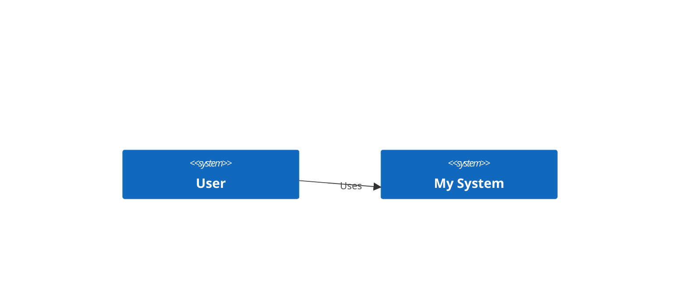
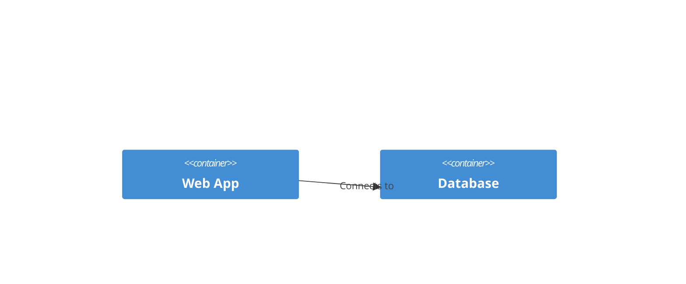

# Architecture Notebook

This is an example of a Sruja notebook.

## System Context

Here we define the system context.

```sruja
workspace {
  model {
    system User "User"
    system System "My System"
    User -> System "Uses"
  }
}
```



## Container View

Here we define the containers.

```sruja
workspace {
  model {
    container WebApp "Web App"
    container DB "Database"
    WebApp -> DB "Connects to"
  }
}
```


