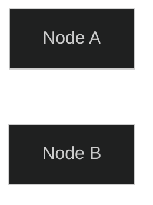

# Mermaid Configuration Guide

## Overview

The markdown exporter supports configuring Mermaid diagrams through style blocks or metadata in your `.sruja` files.

## Configuration Options

### Available Settings

| Option | Type | Default | Description |
|--------|------|---------|-------------|
| `mermaid_layout` | string | `"elk"` | Layout algorithm: `elk` or `dagre` |
| `mermaid_direction` | string | `"LR"` | Diagram direction: `LR`, `TB`, `BT`, `RL` |
| `mermaid_theme` | string | `"default"` | Theme name (e.g., `"dark"`, `"forest"`, `"neutral"`) |
| `mermaid_look` | string | `""` | Look/style preset |
| `mermaid_frontmatter` | boolean | `false` | Use YAML frontmatter for config |

### Configuration Methods

#### Method 1: Style Block

```sruja
architecture "My System" {
    style {
        "mermaid_direction": "TB"
        "mermaid_theme": "dark"
        "mermaid_layout": "dagre"
        "mermaid_frontmatter": "true"
    }
    
    system API "API Service"
}
```

#### Method 2: Metadata Block

```sruja
architecture "My System" {
    metadata {
        mermaid_direction: "TB"
        mermaid_theme: "dark"
        mermaid_frontmatter: "true"
    }
    
    system API "API Service"
}
```

## Direction Options

- `LR` - Left to Right (horizontal, default)
- `TB` - Top to Bottom (vertical)
- `BT` - Bottom to Top
- `RL` - Right to Left

## Layout Options

- `elk` - ELK layout algorithm (default, better for large graphs)
- `dagre` - Dagre layout algorithm (faster, good for smaller graphs)

## Theme Options

Common Mermaid themes include:
- `default` - Default theme
- `dark` - Dark theme
- `forest` - Forest theme
- `neutral` - Neutral theme
- `base` - Base theme

Refer to [Mermaid documentation](https://mermaid.js.org/config/theming.html) for available themes.

## Frontmatter vs Inline Config

### Inline Config (Default)

By default, Mermaid config is written inline in the diagram:



**Pros:**
- Works with all Mermaid renderers
- Simpler output
- No frontmatter parsing required

**Cons:**
- Limited config options in inline format

### YAML Frontmatter

Enable with `mermaid_frontmatter: "true"`:


**Pros:**
- Full config support
- Standard YAML format
- Better for complex configurations

**Cons:**
- Requires frontmatter-supporting renderers
- Not all markdown renderers support this

## Examples

### Vertical Layout with Dark Theme

```sruja
architecture "My System" {
    style {
        "mermaid_direction": "TB"
        "mermaid_theme": "dark"
    }
    
    system API "API Service"
    system DB "Database"
}
```

### Custom Layout with Frontmatter

```sruja
architecture "My System" {
    metadata {
        mermaid_layout: "dagre"
        mermaid_direction: "RL"
        mermaid_frontmatter: "true"
    }
    
    system API "API Service"
}
```

## Implementation Details

Configuration is extracted in this priority order:

1. **Style block** values take precedence
2. **Metadata block** values are used as fallback
3. **Defaults** are used if not specified

The configuration applies to all diagrams in the exported markdown:
- System context diagrams (C4 L1)
- Container diagrams (C4 L2)
- Component diagrams (C4 L3)
- Scenario sequence diagrams
- Deployment diagrams

## Notes

- Configuration is global - all diagrams use the same config
- Direction is applied to all flowchart diagrams
- Theme affects all diagram types
- Frontmatter format may not be supported by all markdown renderers


