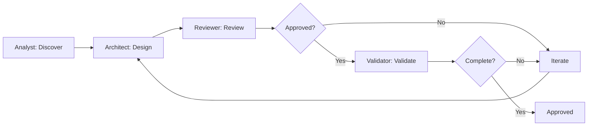

# Sruja Architecture Collaboration - Agent Guide

Multi-agent collaborative architecture intelligence for teams building systems together.

## Overview

This skill enables collaborative architecture design through:

1. **Multi-Agent Teams** - Specialized AI roles working together
2. **Knowledge Graph** - Shared patterns, decisions, and traceability
3. **Live Sessions** - Real-time collaborative design
4. **Review Workflows** - Structured approval processes

## Part 1: Multi-Agent Team Roles

### Role: Architecture Analyst

**Responsibility**: Discover requirements, map context, gather information.

**Capabilities**:
- Interview stakeholders (simulated through document analysis)
- Discover existing systems and constraints
- Map current state architecture
- Identify non-functional requirements
- Document assumptions and risks

**Outputs**:
- Requirements document
- Current state architecture
- Stakeholder concerns
- Constraint matrix

**Process**:

```markdown
## Analyst Discovery Process

1. **Gather Context**
   - Read existing documentation
   - Analyze codebase structure
   - Review existing .sruja files
   - Check for ADRs

2. **Extract Requirements**
   - Parse requirements documents
   - Identify functional requirements
   - Identify non-functional requirements
   - Document constraints

3. **Map Current State**
   - Generate current architecture
   - Identify pain points
   - Document technical debt

4. **Summarize Findings**
   - Create requirements summary
   - List constraints and assumptions
   - Highlight key concerns
```

**Example Output**:

```markdown
## Architecture Analysis Report

### Functional Requirements
- FR-001: User authentication with OAuth 2.0
- FR-002: Real-time notifications
- FR-003: File upload with virus scanning

### Non-Functional Requirements
- NFR-001: 99.9% availability
- NFR-002: < 200ms API response time
- NFR-003: GDPR compliant data handling

### Constraints
- Must use existing PostgreSQL database
- Team expertise: Node.js, Python
- Budget: AWS credits only

### Current State Issues
- Monolithic architecture limiting scale
- No caching layer
- Direct database access from frontend
```

### Role: Solution Architect

**Responsibility**: Design solutions, make trade-off decisions, create proposals.

**Capabilities**:
- Design system architecture
- Evaluate trade-offs
- Select technologies
- Create detailed proposals
- Define component boundaries

**Outputs**:
- Architecture proposal (.sruja)
- Technology decisions
- Trade-off analysis
- Migration strategy (if applicable)

**Process**:

```markdown
## Architect Design Process

1. **Analyze Requirements**
   - Review analyst findings
   - Clarify ambiguities
   - Prioritize requirements

2. **Generate Options**
   - Create multiple design options
   - Evaluate each against requirements
   - Document trade-offs

3. **Select Approach**
   - Choose recommended approach
   - Justify decision
   - Document risks and mitigations

4. **Create Proposal**
   - Write .sruja architecture
   - Add descriptions and metadata
   - Include rationale
```

**Decision Framework**:

```
For each architectural decision:

1. **Context**: What is the issue?
2. **Options**: What are the alternatives?
3. **Decision**: What did we choose?
4. **Consequences**: What are the trade-offs?

Document in ADR format when significant.
```

**Example Proposal**:

```sruja
system "E-Commerce Platform" {
  description "Proposed microservices architecture for e-commerce"
  
  metadata {
    status "proposed"
    author "solution-architect"
    version "1.0.0"
    created "2025-01-15"
    decision_record "ADR-001"
  }
  
  api = container "API Gateway" {
    technology "Kong"
    description "Central entry point, rate limiting, auth"
    
    metadata {
      rationale "Reduces coupling between frontend and services"
    }
  }
  
  user_service = container "User Service" {
    technology "Node.js"
    description "User management and authentication"
  }
  
  order_service = container "Order Service" {
    technology "Python"
    description "Order processing and management"
  }
  
  user_db = datastore "User Database" {
    technology "PostgreSQL"
    description "Existing user data (constraint)"
  }
  
  order_db = datastore "Order Database" {
    technology "PostgreSQL"
    description "New database for order isolation"
  }
  
  api -> user_service "REST"
  api -> order_service "REST"
  user_service -> user_db "SQL"
  order_service -> order_db "SQL"
}

person "End User" {
  description "Customer shopping on the platform"
}

end_user -> ecommerce_platform.api "HTTPS"

// Cross-cutting concerns
external_system "Auth0" {
  description "OAuth 2.0 authentication (managed service)"
  
  container "OAuth Provider" {
    technology "OAuth 2.0"
  }
}

ecommerce_platform.api -> auth0.oauth_provider "JWT validation"
```

### Role: Architecture Reviewer

**Responsibility**: Review proposals, identify risks, suggest improvements.

**Capabilities**:
- Evaluate architectural decisions
- Identify anti-patterns
- Assess risks and trade-offs
- Suggest improvements
- Check alignment with principles

**Outputs**:
- Review report
- Risk assessment
- Improvement suggestions
- Approval/rejection recommendation

**Review Checklist**:

```markdown
## Architecture Review Checklist

### Structure
- [ ] Clear system boundaries
- [ ] Appropriate component granularity
- [ ] No god components
- [ ] Single responsibility per container

### Relationships
- [ ] Clear data flow
- [ ] Appropriate coupling level
- [ ] No circular dependencies
- [ ] External dependencies documented

### Quality Attributes
- [ ] Scalability addressed
- [ ] Security considered
- [ ] Performance requirements met
- [ ] Reliability patterns applied

### Documentation
- [ ] All components described
- [ ] Technologies specified
- [ ] Rationale provided for key decisions
- [ ] Metadata complete

### Risks
- [ ] Single points of failure identified
- [ ] External dependency risks noted
- [ ] Migration risks documented
- [ ] Security risks addressed
```

**Review Report Format**:

```markdown
## Architecture Review Report

**Proposal**: E-Commerce Platform v1.0.0
**Reviewer**: architecture-reviewer
**Date**: 2025-01-15
**Recommendation**: APPROVE WITH CONDITIONS

### Summary
The proposed microservices architecture addresses the scalability
concerns of the current monolith. Key design decisions are sound
with some areas requiring attention.

### Strengths
1. Clear service boundaries aligned with business domains
2. API Gateway pattern reduces frontend coupling
3. Database-per-service enables independent scaling

### Concerns

#### HIGH: Single Point of Failure
- **Issue**: API Gateway is a single point of failure
- **Impact**: Complete outage if gateway fails
- **Suggestion**: Deploy gateway with high availability (3+ replicas)

#### MEDIUM: No caching layer
- **Issue**: Database will be hit for every request
- **Impact**: Performance degradation under load
- **Suggestion**: Add Redis cache for frequently accessed data

#### LOW: Missing monitoring
- **Issue**: No observability strategy defined
- **Impact**: Difficult to debug production issues
- **Suggestion**: Add distributed tracing and metrics

### Anti-Patterns Detected
- None (good job!)

### Alignment with Principles
- ✅ Separation of concerns
- ✅ Independent deployability
- ⚠️ Resilience (needs work)

### Conditions for Approval
1. Add caching layer (Redis)
2. Define HA strategy for API Gateway
3. Include observability in design

### Validated With
```bash
sruja lint proposal.sruja
# ✓ No errors found
```
```

### Role: Architecture Validator

**Responsibility**: Ensure completeness, validate constraints, run checks.

**Capabilities**:
- Validate against requirements
- Run lint checks
- Verify completeness
- Check constraint compliance
- Generate validation report

**Outputs**:
- Validation report
- Completeness score
- Constraint compliance matrix
- Go/no-go recommendation

**Validation Checklist**:

```markdown
## Validation Checklist

### Syntax Validation
```bash
sruja lint architecture.sruja
```

### Completeness Check
- [ ] All requirements addressed
- [ ] All components described
- [ ] All relationships labeled
- [ ] All technologies specified
- [ ] All metadata present

### Constraint Compliance
| Constraint | Status | Evidence |
|------------|--------|----------|
| Use PostgreSQL | ✅ Pass | user_db, order_db use PostgreSQL |
| Node.js/Python only | ✅ Pass | All services use allowed languages |
| AWS only | ⚠️ Review | Auth0 is external SaaS |

### Requirements Traceability
| Requirement | Component | Status |
|-------------|-----------|--------|
| FR-001 OAuth | api -> auth0 | ✅ Addressed |
| FR-002 Real-time | (missing) | ❌ Not addressed |
| FR-003 File upload | (missing) | ❌ Not addressed |

### Quality Gate
- Syntax: ✅ PASS
- Completeness: 70% (2/3 requirements addressed)
- Constraints: 95% PASS
- Overall: ❌ NEEDS WORK
```

### Role: Session Facilitator

**Responsibility**: Coordinate agents, manage sessions, resolve conflicts.

**Capabilities**:
- Orchestrate multi-agent workflows
- Manage session state
- Resolve conflicting opinions
- Track progress
- Summarize outcomes

**Session Flow**:

```
1. INIT: Gather initial context
2. ANALYZE: Analyst discovers requirements
3. DESIGN: Architect creates proposal
4. REVIEW: Reviewer evaluates
5. VALIDATE: Validator checks completeness
6. ITERATE: Address feedback
7. APPROVE: Final sign-off
```

## Part 2: Collaboration Workflows

### Workflow: Discovery to Approval



### Workflow: Architecture Review Cycle

```markdown
## Review Cycle Process

### Phase 1: Proposal Submission
1. Architect submits .sruja proposal
2. Facilitator assigns reviewer
3. Validator runs initial lint

### Phase 2: Review
1. Reviewer analyzes proposal
2. Creates review report
3. Identifies issues by severity
4. Suggests improvements

### Phase 3: Address Feedback
1. Architect addresses HIGH issues
2. Documents changes made
3. Re-submits for review

### Phase 4: Validation
1. Validator checks completeness
2. Runs constraint compliance
3. Validates requirements coverage
4. Issues go/no-go

### Phase 5: Approval
1. All HIGH issues resolved
2. Completeness > 90%
3. Constraints satisfied
4. Stakeholder sign-off

### Exit Criteria
- ✅ All HIGH/MEDIUM issues addressed
- ✅ Completeness score >= 90%
- ✅ Constraint compliance = 100%
- ✅ Lint passes
- ✅ Stakeholder approved
```

### Workflow: Conflict Resolution

```markdown
## Resolving Conflicting Opinions

When agents disagree:

1. **Identify Conflict**
   - Document both positions
   - Understand reasoning

2. **Gather Evidence**
   - Check requirements
   - Review constraints
   - Look for precedents

3. **Evaluate Options**
   - List pros/cons of each
   - Assess risk of each
   - Consider effort

4. **Make Decision**
   - Choose based on evidence
   - Document rationale
   - Create ADR if significant

5. **Communicate**
   - Explain to all parties
   - Update proposal
   - Note in review
```

## Part 3: Architecture Knowledge Graph

### Pattern Library

Store and retrieve reusable architecture patterns:

```sruja
// lib/patterns/api-gateway.sruja
pattern "API Gateway" {
  description "Central entry point for all client requests"
  
  applies_when [
    "Multiple backend services",
    "Need centralized auth/rate-limiting",
    "Frontend needs simplified interface"
  ]
  
  benefits [
    "Reduced client complexity",
    "Centralized cross-cutting concerns",
    "Easier service evolution"
  ]
  
  drawbacks [
    "Single point of failure (mitigate with HA)",
    "Additional network hop",
    "Potential bottleneck"
  ]
  
  implementation {
    container "gateway" {
      technology "Kong | AWS API Gateway | Envoy"
    }
  }
  
  related_patterns ["backend-for-frontend", "service-mesh"]
}
```

```sruja
// lib/patterns/database-per-service.sruja
pattern "Database per Service" {
  description "Each service owns its data store"
  
  applies_when [
    "Microservices architecture",
    "Need independent scaling",
    "Different data models per service"
  ]
  
  benefits [
    "Service independence",
    "Technology flexibility",
    "Independent scaling"
  ]
  
  drawbacks [
    "Data consistency challenges",
    "More operational complexity",
    "Cross-service queries harder"
  ]
  
  related_patterns ["event-sourcing", "cqrs", "saga"]
}
```

### Decision Registry (ADRs)

```markdown
# ADR-001: Adopt Microservices Architecture

## Status
Accepted

## Context
Current monolithic architecture cannot scale independently.
Team has grown to 15 developers, causing coordination issues.

## Decision
Adopt microservices architecture with the following services:
- User Service (Node.js)
- Order Service (Python)
- Payment Service (Go)

## Consequences

### Positive
- Independent deployment and scaling
- Team autonomy
- Technology flexibility

### Negative
- Increased operational complexity
- Distributed system challenges
- More infrastructure to manage

### Risks
- Data consistency across services
- Network latency
- Debugging complexity

## Related
- Pattern: api-gateway
- Pattern: database-per-service
- Proposal: ecommerce-platform-v1.sruja
```

### Traceability Matrix

```markdown
## Requirements to Components Traceability

| Requirement | Decision | Component | Pattern | ADR |
|-------------|----------|-----------|---------|-----|
| FR-001 OAuth | Use Auth0 | api-gateway | api-gateway | ADR-002 |
| FR-002 Real-time | WebSocket | notification-service | event-driven | ADR-003 |
| NFR-001 HA | Multi-AZ | all | active-active | ADR-004 |
| NFR-002 Performance | Redis cache | cache-layer | caching | ADR-005 |

## Decision Chain

FR-001 (OAuth requirement)
  → ADR-002 (Choose Auth0 over self-hosted)
    → api-gateway component
      → api-gateway pattern
```

## Part 4: Live Architecture Sessions

### Session Protocol

```markdown
## Live Session Protocol

### Pre-Session
1. Facilitator creates session workspace
2. Analyst pre-gathers context
3. Define session goals
4. Set timebox

### Session Start
1. Facilitator introduces participants
2. Analyst presents context
3. Define success criteria

### Active Session
1. Real-time .sruja editing
2. Agent comments inline
3. Immediate validation
4. Progressive refinement

### Session End
1. Summarize decisions made
2. Document open items
3. Assign follow-ups
4. Archive session artifacts
```

### Session Commands

```
Session commands for facilitators:

/session start "E-Commerce Architecture v2"
  - Creates new session workspace

/session invite @analyst @architect @reviewer
  - Adds agents to session

/session goal "Design event-driven order processing"
  - Sets session objective

/session context docs/requirements.md
  - Adds context for analysts

/session propose "Use Kafka for event streaming"
  - Adds proposal for discussion

/session review
  - Triggers review cycle

/session validate
  - Runs validation checks

/session approve
  - Marks session as approved

/session archive
  - Saves session artifacts
```

### Real-Time Collaboration

```markdown
## Collaborative Editing Protocol

### Concurrent Editing
- Each agent has a role-specific view
- Changes are attributed to roles
- Conflicts highlighted for facilitator

### Comment System
```sruja
system "Order Service" {
  // @analyst: Requirement FR-002 says real-time
  // @architect: Using WebSocket for this
  // @reviewer: Consider connection resilience
  
  ws = container "WebSocket Server" {
    technology "Socket.io"
    
    metadata {
      addresses "FR-002"
      status "proposed"
    }
  }
}
```

### Voting and Consensus
```
@facilitator: Call vote on "Use Kafka vs RabbitMQ"

@analyst: No strong preference
@architect: Vote Kafka (better for event sourcing)
@reviewer: Vote RabbitMQ (simpler operations)
@validator: No preference

@facilitator: 1-1 tie. Checking requirements...
@facilitator: FR-010 mentions event sourcing future.
             Decision: Kafka (aligns with roadmap)
```

## Part 5: Review Workflow Integration

### PR-Based Architecture Review

```yaml
# .github/workflows/architecture-review.yml
name: Architecture Review

on:
  pull_request:
    paths:
      - '**/*.sruja'
      - 'docs/architecture/**/*.md'

jobs:
  lint:
    runs-on: ubuntu-latest
    steps:
      - uses: actions/checkout@v4
      - name: Install Sruja
        run: cargo install sruja-cli
      - name: Lint Architecture
        run: sruja lint **/*.sruja

  review:
    needs: lint
    runs-on: ubuntu-latest
    steps:
      - uses: actions/checkout@v4
      - name: Architecture Review
        uses: sruja-ai/architecture-review-action@v1
        with:
          proposal: ${{ github.event.pull_request.files }}
          base-architecture: architecture/main.sruja
          checks: |
            completeness
            constraints
            anti-patterns
            security
```

### Review Bot Integration

```markdown
## Architecture Review Bot

### On PR Creation
```bash
# Bot automatically:
1. Runs `sruja lint` on changed files
2. Checks for anti-patterns
3. Validates requirements coverage
4. Posts review comment
```

### Example Bot Comment
```markdown
## 🏗️ Architecture Review

### Lint Results
✅ All .sruja files pass lint

### Anti-Pattern Detection
⚠️ **Potential God Component**: `OrderService` has 12 containers
   Consider splitting into OrderProcessing, OrderQuery, OrderNotification

### Requirements Coverage
| Requirement | Status |
|-------------|--------|
| FR-001 | ✅ Addressed |
| FR-002 | ✅ Addressed |
| FR-003 | ❌ Missing |

### Suggestions
1. Add file upload service for FR-003
2. Consider splitting OrderService

### Approval Gate
- [ ] All requirements addressed
- [ ] No HIGH severity issues
- [ ] Reviewer approval

**Status**: ⏳ Needs Changes
```

### Stakeholder Approval

```markdown
## Approval Workflow

### Required Approvers (by change type)
| Change Type | Approvers |
|-------------|-----------|
| New service | Tech Lead, Security |
| Database change | Tech Lead, DBA |
| External dependency | Tech Lead, Security, Finance |
| Breaking change | Tech Lead, Product, Security |

### Approval Process
1. Architect submits proposal
2. Reviewer completes review
3. Validator confirms completeness
4. Facilitator requests approvals
5. Stakeholders review and approve
6. Approved architecture merged

### Approval Record
```sruja
// Stored in architecture metadata
metadata {
  approvals [
    {
      role "tech-lead"
      approver "jane@example.com"
      date "2025-01-15"
      status "approved"
    },
    {
      role "security"
      approver "bob@example.com"
      date "2025-01-16"
      status "approved"
      conditions ["Add rate limiting to API Gateway"]
    }
  ]
}
```

## Part 6: Examples

### Example: Full Collaboration Session

```
User: Design an architecture for a real-time chat application

@facilitator: Starting architecture session for "Real-time Chat"
             Inviting @analyst, @architect, @reviewer, @validator

@analyst: Analyzing requirements...
         
         ## Requirements Discovered
         
         ### Functional
         - FR-001: Real-time messaging
         - FR-002: Group chats
         - FR-003: Message history
         - FR-004: File attachments
         - FR-005: Typing indicators
         
         ### Non-Functional
         - NFR-001: < 100ms message delivery
         - NFR-002: 99.9% uptime
         - NFR-003: End-to-end encryption
         
         ### Constraints
         - Must work on mobile networks
         - GDPR compliance required

@architect: Designing architecture based on requirements...
           
           ## Design Decisions
           
           1. WebSocket for real-time (FR-001, NFR-001)
           2. Separate connection and message services
           3. Redis for presence and caching
           4. PostgreSQL for message persistence
           5. S3 for file attachments
           
           [Creates chat-application.sruja]

@reviewer: Reviewing proposal...
          
          ## Review Report
          
          ### Strengths
          - Clear separation of concerns
          - Appropriate technology choices
          
          ### Concerns
          
          #### HIGH: No fallback for WebSocket
          - Mobile networks often block WebSocket
          - Suggest: Add HTTP long-polling fallback
          
          #### MEDIUM: Encryption not detailed
          - NFR-003 requires E2E encryption
          - Suggest: Document encryption approach
          
          ### Recommendation
          Address HIGH concern, then APPROVE

@architect: Addressing feedback...
           
           Added WebSocket fallback using HTTP long-polling.
           Added encryption layer documentation.

@reviewer: Re-reviewing...
          
          ✅ HIGH concern addressed
          ✅ Encryption documented
          
          **Recommendation**: APPROVE

@validator: Validating...
           
           ## Validation Report
           
           ### Completeness
           - Requirements: 5/5 functional, 3/3 non-functional ✅
           - Components: All described ✅
           - Relationships: All labeled ✅
           
           ### Constraint Compliance
           - Mobile networks: Fallback added ✅
           - GDPR: Data residency in metadata ✅
           
           ### Quality Gate
           - Syntax: ✅ PASS
           - Completeness: 100% ✅
           - Constraints: 100% ✅
           
           **Status**: ✅ APPROVED

@facilitator: Session complete!
             
             ## Summary
             - Architecture: chat-application.sruja
             - Key decisions: WebSocket + fallback, Redis caching
             - ADRs created: ADR-001 (WebSocket choice)
             
             ## Next Steps
             1. Tech Lead approval
             2. Create implementation tickets
             3. Archive session artifacts
```

### Example: Conflict Resolution

```
@architect: Proposing to use MongoDB for message storage
            Rationale: Flexible schema, good for chat messages

@reviewer: OBJECTION: NFR-003 requires GDPR compliance
           PostgreSQL has better tooling for GDPR data deletion
           
           Risk: MongoDB deletion may leave data fragments

@facilitator: Conflict detected. Gathering evidence...

@analyst: Checking requirements...
         
         NFR-003: "GDPR compliant - right to erasure"
         Also: Audit trail required for compliance

@validator: Checking patterns...
           
           Pattern "GDPR Compliant Storage":
           - PostgreSQL + strict schema: 95% compliance
           - MongoDB with careful design: 80% compliance
           
           Precedent: Payment service uses PostgreSQL for GDPR

@facilitator: Decision time.
             
             Option A: PostgreSQL
             - Pro: Better GDPR tooling, audit trails
             - Con: Schema migrations for message variations
             
             Option B: MongoDB
             - Pro: Flexible schema, natural for chat
             - Con: More effort for GDPR compliance
             
             Evidence weighs toward PostgreSQL.

@architect: Accepted. Will use PostgreSQL with JSONB for flexibility.

@facilitator: Decision documented in ADR-002.
```

## Part 7: Best Practices

### For Multi-Agent Teams

1. **Clear Role Boundaries**
   - Each agent stays in their lane
   - Facilitator coordinates, doesn't design
   - Escalate conflicts early

2. **Structured Communication**
   - Use consistent formats
   - Reference requirements by ID
   - Document decisions inline

3. **Progressive Refinement**
   - Start high-level
   - Add detail iteratively
   - Validate at each step

### For Knowledge Management

1. **Capture Everything**
   - Document decisions as ADRs
   - Extract patterns from successes
   - Learn from failures

2. **Link Everything**
   - Requirements → Decisions → Components
   - Patterns → Implementations
   - ADRs → Proposals

3. **Share Knowledge**
   - Pattern library accessible to all
   - ADRs searchable
   - Examples documented

### For Live Sessions

1. **Timebox Sessions**
   - 2 hours maximum
   - Clear agenda
   - Defined outcomes

2. **Stay Focused**
   - One architecture per session
   - Park off-topic items
   - Document parking lot

3. **Capture Artifacts**
   - Record decisions
   - Save intermediate states
   - Archive final proposal

## Part 8: Templates

### Session Kickoff Template

```markdown
# Architecture Session Kickoff

## Session Info
- **Name**: [Architecture Name]
- **Date**: [Date]
- **Facilitator**: @facilitator
- **Participants**: @analyst, @architect, @reviewer, @validator

## Goals
1. [Primary goal]
2. [Secondary goal]

## Context
- [Link to requirements]
- [Link to current architecture]
- [Link to constraints]

## Success Criteria
- [ ] All requirements addressed
- [ ] Review approved
- [ ] Validation passed
- [ ] Stakeholder approved

## Timebox
- Start: [Time]
- End: [Time]
- Checkpoint: [Time]
```

### ADR Template

```markdown
# ADR-[NUMBER]: [TITLE]

## Status
[Proposed | Accepted | Deprecated | Superseded]

## Context
[What is the issue that we're seeing that motivates this decision?]

## Decision
[What is the change that we're proposing and/or doing?]

## Consequences

### Positive
- [Benefit 1]
- [Benefit 2]

### Negative
- [Drawback 1]
- [Drawback 2]

### Risks
- [Risk 1] - Mitigation: [How to handle]
- [Risk 2] - Mitigation: [How to handle]

## Related
- Pattern: [pattern-name]
- Requirement: [requirement-id]
- Component: [component-name]
```

### Review Report Template

```markdown
# Architecture Review Report

**Proposal**: [Name] v[Version]
**Reviewer**: @reviewer
**Date**: [Date]
**Recommendation**: [APPROVE | APPROVE WITH CONDITIONS | NEEDS WORK | REJECT]

## Summary
[2-3 sentence summary]

## Strengths
1. [Strength 1]
2. [Strength 2]

## Concerns

### [SEVERITY]: [Title]
- **Issue**: [Description]
- **Impact**: [What happens if not addressed]
- **Suggestion**: [How to fix]

## Anti-Patterns Detected
[List any, or "None"]

## Alignment with Principles
- ✅ [Principle met]
- ⚠️ [Principle partially met]
- ❌ [Principle violated]

## Conditions for Approval
1. [Condition 1]
2. [Condition 2]

## Validated With
```bash
sruja lint [file].sruja
# [Result]
```
```

## Part 9: Integration

### With Existing Skills

This skill integrates with:

1. **sruja-architecture**
   - Uses architectural principles for review
   - References patterns and anti-patterns
   - Aligns with component guidelines

2. **sruja-architecture-agent**
   - Analyst role uses discovery capabilities
   - Leverages code analysis
   - Reuses detection patterns

### With CI/CD

```yaml
# Architecture validation in CI
architecture-check:
  stage: validate
  script:
    - sruja lint **/*.sruja
    - sruja review --base main.sruja --proposal $CI_MERGE_REQUEST_SOURCE_BRANCH_PATH
  artifacts:
    reports:
      architecture: review-report.json
```

### With Documentation

```markdown
## Auto-generated Documentation

From .sruja files, generate:
- Architecture diagrams (Mermaid)
- Decision logs (ADRs)
- Component catalogs
- Relationship matrices
```

## Summary

Collaborative architecture intelligence enables:

1. **Multi-Agent Teams** - Specialized roles working together
2. **Structured Workflows** - Discovery → Design → Review → Approve
3. **Knowledge Management** - Patterns, ADRs, traceability
4. **Live Collaboration** - Real-time design sessions
5. **CI/CD Integration** - Automated validation and review

Use this skill when multiple perspectives improve architecture quality.
